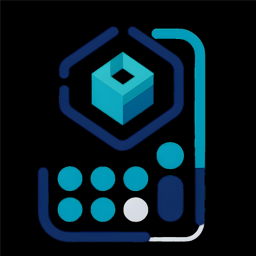

# 🖨️ 3D Print Cost Calculator

<div align="center">
  
  
  <h3>Una aplicación web completa para la gestión y cálculo de costos de impresión 3D</h3>
  
  <p>Diseñada para negocios y profesionales que necesitan controlar sus operaciones de impresión 3D de manera eficiente</p>

  [](https://3dprintcost.dev)
  [](https://nextjs.org/)
  [](https://www.typescriptlang.org/)
</div>

## 🖼️ Preview de la Aplicación

<div align="center">
  
  <p><em>Dashboard principal con métricas en tiempo real</em></p>
  
  
  <p><em>Calculadora de costos de impresión 3D</em></p>
</div>

## 🌐 Demo en Vivo

<div align="center">
  <h3>¡Prueba la aplicación ahora mismo!</h3>
  
  <p>
    <a href="https://3dprintcost.dev" target="_blank">
      
    </a>
  </p>
  
  <p><em>Accede a la aplicación completa con 14 días de prueba gratuita</em></p>
</div>

## 📋 Tabla de Contenidos

- [Características Principales](#-características-principales)
- [Tecnologías Utilizadas](#-tecnologías-utilizadas)
- [Instalación y Configuración](#-instalación-y-configuración)
- [Estructura del Proyecto](#-estructura-del-proyecto)
- [Funcionalidades Detalladas](#-funcionalidades-detalladas)
- [API y Backend](#-api-y-backend)
- [Despliegue](#-despliegue)
- [Contribución](#-contribución)
- [Licencia](#-licencia)

## 🚀 Características Principales

### 💼 Gestión de Negocio

- **Dashboard Completo**: Panel de control con estadísticas en tiempo real
- **Gestión de Clientes**: Base de datos completa de clientes con información de contacto
- **Sistema de Ventas**: Control de cotizaciones, pedidos y facturación
- **Registro de Gastos**: Seguimiento de gastos operativos y categorización

### 🖨️ Gestión de Impresión 3D
- **Calculadora de Costos**: Cálculo automático de costos de impresión
- **Gestión de Filamentos**: Inventario con control de stock y costos por gramo
- **Administración de Impresoras**: Configuración de máquinas y consumo energético
- **Historial de Impresiones**: Registro detallado de todas las impresiones realizadas
- **Paquetes de Trabajo**: Configuración de tarifas por tipo de trabajo

### 📊 Análisis y Reportes
- **Métricas de Rentabilidad**: Análisis de ganancias y márgenes
- **Estadísticas de Uso**: Tiempo de impresión, consumo de materiales
- **Alertas de Stock**: Notificaciones de filamentos con bajo inventario
- **Reportes Detallados**: Exportación de datos para análisis externo

### ⚙️ Configuración y Personalización
- **Configuración del Sistema**: Parámetros globales para cálculos
- **Gestión de Monedas**: Soporte para múltiples monedas (COP, USD, EUR, MXN, ARS, BRL)
- **Configuración de Empresa**: Datos corporativos personalizables
- **Tema Oscuro/Claro**: Interfaz adaptable a preferencias del usuario

## 🛠️ Tecnologías Utilizadas

<div align="center">
  <h3>Stack Tecnológico</h3>
  
  
  
  <h4>Frontend</h4>
  <p>
    
    
    
    
  </p>
  
  <h4>Backend & APIs</h4>
  <p>
    
    
    
  </p>
  
  <h4>Herramientas</h4>
  <p>
    
    
    
  </p>
</div>

### Frontend
- **Next.js 14.2.16** - Framework de React con App Router
- **React 18** - Biblioteca de interfaz de usuario
- **TypeScript 5** - Tipado estático para JavaScript
- **Tailwind CSS 4.1.9** - Framework de CSS utilitario
- **Radix UI** - Componentes de interfaz accesibles
- **Lucide React** - Iconografía moderna
- **React Hook Form** - Manejo de formularios
- **Zod** - Validación de esquemas
- **Recharts** - Gráficos y visualizaciones
- **Three.js** - Gráficos 3D para animaciones

### Backend y APIs
- **API REST** - Servicios backend para gestión de datos
- **Autenticación JWT** - Sistema de autenticación seguro
- **Bold.co** - Procesamiento de pagos
- **Sistema de Suscripciones** - Gestión de planes de pago

### Herramientas de Desarrollo
- **ESLint** - Linting de código
- **PostCSS** - Procesamiento de CSS
- **Autoprefixer** - Compatibilidad de CSS
- **Vercel Analytics** - Análisis de rendimiento

## 🚀 Instalación y Configuración

### Prerrequisitos
- Node.js 18+ 
- npm, yarn o pnpm
- Git

### Pasos de Instalación

1. **Clonar el repositorio**
```bash
git clone https://github.com/tu-usuario/printing-cost-app.git
cd printing-cost-app
```

2. **Instalar dependencias**
```bash
# Con npm
npm install

# Con yarn
yarn install

# Con pnpm
pnpm install
```

3. **Configurar variables de entorno**
Crear un archivo `.env.local` en la raíz del proyecto:
```env
NEXT_PUBLIC_API_URL=http://localhost:5081
NEXT_PUBLIC_BOLD_API_KEY=tu_api_key_de_bold
```

4. **Ejecutar en modo desarrollo**
```bash
npm run dev
# o
yarn dev
# o
pnpm dev
```

5. **Abrir en el navegador**
Visitar [http://localhost:3000](http://localhost:3000)

### Scripts Disponibles

```bash
# Desarrollo
npm run dev

# Construcción para producción
npm run build

# Iniciar servidor de producción
npm run start

# Linting
npm run lint
```

## 📁 Estructura del Proyecto

```
printing-cost-app/
├── app/                          # App Router de Next.js
│   ├── (dashboard)/             # Rutas protegidas del dashboard
│   │   ├── calculadora-costos/   # Calculadora de costos
│   │   ├── clientes/            # Gestión de clientes
│   │   ├── configuracion/       # Configuración del sistema
│   │   ├── dashboard/           # Panel principal
│   │   ├── filamentos/          # Gestión de filamentos
│   │   ├── gastos/              # Registro de gastos
│   │   ├── historial-impresion/ # Historial de impresiones
│   │   ├── impresoras/          # Gestión de impresoras
│   │   ├── paquetes-trabajo/    # Paquetes de trabajo
│   │   ├── productos/           # Catálogo de productos
│   │   └── ventas/              # Sistema de ventas
│   ├── login/                   # Página de inicio de sesión
│   ├── signup/                  # Página de registro
│   ├── payment-result/          # Resultado de pagos
│   └── renovar-suscripcion/     # Renovación de suscripción
├── components/                  # Componentes reutilizables
│   ├── auth/                   # Componentes de autenticación
│   ├── calculator/             # Calculadora de costos
│   ├── client/                 # Gestión de clientes
│   ├── expense/                # Gestión de gastos
│   ├── filament/               # Gestión de filamentos
│   ├── landing/                # Página de inicio
│   ├── printer/                # Gestión de impresoras
│   ├── product/                # Gestión de productos
│   ├── sale/                   # Sistema de ventas
│   ├── shared/                 # Componentes compartidos
│   ├── subscription/           # Sistema de suscripciones
│   ├── systenConfig/          # Configuración del sistema
│   └── ui/                     # Componentes de interfaz
├── lib/                        # Utilidades y configuración
│   ├── api.ts                  # Cliente API
│   ├── auth.ts                 # Servicios de autenticación
│   ├── contexts/               # Contextos de React
│   ├── hooks/                  # Hooks personalizados
│   └── types.ts                # Definiciones de tipos
└── public/                     # Archivos estáticos
```

## 🔧 Funcionalidades Detalladas

### 📊 Dashboard
- **Métricas en Tiempo Real**: Total de clientes, ventas, filamentos, impresoras
- **Estadísticas Financieras**: Ingresos totales, gastos, ganancias
- **Alertas del Sistema**: Filamentos con stock bajo, impresoras inactivas
- **Gráficos Interactivos**: Visualización de datos con Recharts
- **Ventas Recientes**: Lista de las últimas transacciones

### 👥 Gestión de Clientes
- **Registro Completo**: Nombre, email, teléfono, dirección, ciudad
- **Búsqueda y Filtrado**: Encontrar clientes rápidamente
- **Historial de Ventas**: Seguimiento de compras por cliente
- **Paginación**: Manejo eficiente de grandes listas

### 🛒 Sistema de Ventas
- **Creación de Cotizaciones**: Generación de presupuestos detallados
- **Gestión de Pedidos**: Seguimiento del estado de las ventas
- **Cálculo Automático**: Precios basados en materiales y trabajo
- **Detalles de Venta**: Productos, cantidades, comentarios
- **Estados de Venta**: Pendiente, en proceso, completado, cancelado

### 🧮 Calculadora de Costos
- **Cálculo Automático**: Costos de filamento, energía, trabajo
- **Múltiples Filamentos**: Soporte para impresiones multicolor
- **Configuración Flexible**: Parámetros personalizables por proyecto
- **Margen de Ganancia**: Aplicación automática de márgenes
- **Tiempo de Impresión**: Estimación precisa de duración

### 🎨 Gestión de Filamentos
- **Inventario Completo**: Tipo, color, costo por gramo, densidad
- **Control de Stock**: Seguimiento de inventario en tiempo real
- **Alertas de Stock Bajo**: Notificaciones automáticas
- **Múltiples Colores**: Soporte para filamentos multicolor
- **Historial de Consumo**: Seguimiento de uso por impresión

### 🖨️ Administración de Impresoras
- **Registro Detallado**: Nombre, modelo, descripción, estado
- **Consumo Energético**: Configuración de kWh por hora
- **Estados de Máquina**: Activa, inactiva, mantenimiento
- **Asignación de Trabajos**: Gestión de colas de impresión

### 📈 Historial de Impresiones
- **Registro Completo**: Todas las impresiones realizadas
- **Consumo de Materiales**: Gramos utilizados por filamento
- **Costos Detallados**: Desglose de costos por componente
- **Tiempo de Impresión**: Duración real vs estimada
- **Asociación con Productos**: Vinculación con catálogo

### 📦 Gestión de Productos
- **Catálogo Personalizado**: Productos con imágenes y descripciones
- **Enlaces Externos**: Referencias a modelos 3D
- **Historial de Impresión**: Seguimiento de impresiones por producto
- **Categorización**: Organización por tipos de productos

### 💼 Paquetes de Trabajo
- **Configuración Flexible**: Diferentes tipos de trabajo
- **Tarifas Personalizadas**: Precios por hora o por proyecto
- **Cálculo Automático**: Integración con calculadora de costos
- **Descripciones Detalladas**: Especificaciones de cada paquete

### 💰 Gestión de Gastos
- **Categorización**: Gastos operativos organizados
- **Fechas de Registro**: Seguimiento temporal de gastos
- **Montos Detallados**: Control preciso de costos
- **Reportes**: Análisis de gastos por período

### ⚙️ Configuración del Sistema
- **Parámetros Globales**: Configuración de tarifas y costos
- **Información de Empresa**: Datos corporativos
- **Configuración de Moneda**: Soporte multi-moneda
- **Margen de Ganancia**: Configuración de márgenes por defecto
- **Valor Mínimo de Pedido**: Límites de venta

## 🔌 API y Backend

### Endpoints Principales
- **Autenticación**: `/auth/login`, `/auth/signup`
- **Clientes**: `/clients` (CRUD completo)
- **Ventas**: `/sales` (CRUD completo)
- **Filamentos**: `/filaments` (CRUD completo)
- **Impresoras**: `/printers` (CRUD completo)
- **Productos**: `/products` (CRUD completo)
- **Gastos**: `/expenses` (CRUD completo)
- **Configuración**: `/system-config` (CRUD completo)
- **Dashboard**: `/dashboard` (métricas agregadas)

### Autenticación
- **JWT Tokens**: Autenticación basada en tokens
- **Sesiones Persistentes**: Almacenamiento seguro en localStorage
- **Validación de Suscripción**: Verificación de estado de pago
- **Protección de Rutas**: Middleware de autenticación

### Pagos
- **Bold.co Integration**: Procesamiento de pagos seguro
- **Suscripciones**: Gestión de planes mensuales
- **Período de Prueba**: 14 días gratis
- **Renovación Automática**: Gestión de renovaciones

## 🚀 Despliegue

### 🌐 Aplicación en Vivo
La aplicación está desplegada y disponible en:
**https://3dprintcost.dev**

### Vercel (Recomendado)
1. Conectar repositorio a Vercel
2. Configurar variables de entorno
3. Desplegar automáticamente

### Variables de Entorno de Producción
```env
NEXT_PUBLIC_API_URL=https://tu-api-backend.com
NEXT_PUBLIC_BOLD_API_KEY=tu_api_key_de_bold_produccion
```

### Build de Producción
```bash
npm run build
npm run start
```

### Acceso Rápido
<div align="center">
  <a href="https://3dprintcost.dev" target="_blank">
    
  </a>
</div>

## 🤝 Contribución

1. Fork el proyecto
2. Crear una rama para tu feature (`git checkout -b feature/AmazingFeature`)
3. Commit tus cambios (`git commit -m 'Add some AmazingFeature'`)
4. Push a la rama (`git push origin feature/AmazingFeature`)
5. Abrir un Pull Request

## 📄 Licencia

Este proyecto está bajo la Licencia MIT. Ver el archivo `LICENSE` para más detalles.

## 📞 Soporte

- **🌐 Sitio Web**: [https://3dprintcost.dev](https://3dprintcost.dev)
- **📱 WhatsApp**: [+57 300 671 7164](https://wa.me/+573006717164)
- **📧 Email**: soporte@3dprintcost.dev
- **📚 Documentación**: [docs.3dprintcost.dev](https://docs.3dprintcost.dev)

## 🎯 Roadmap

- [ ] **App Móvil**: Versión React Native
- [ ] **API Pública**: Documentación completa
- [ ] **Integración con CAD**: Plugins para software de diseño
- [ ] **Reportes Avanzados**: Exportación a PDF/Excel
- [ ] **Multi-idioma**: Soporte para inglés y otros idiomas
- [ ] **Integración con E-commerce**: Plugins para tiendas online

---

<div align="center">
  
  
  <h3>Desarrollado con ❤️ por Rade Studio</h3>
  
  <p>Para la comunidad de impresión 3D</p>
  
  
</div>